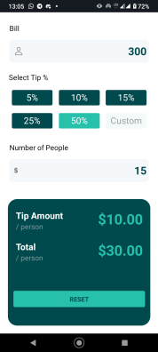

# Tip-Splitter-Mobile-App

Splitter helps to you calculate the tip and split the total bill between friends!

This app was created using [Expo](https://expo.dev/) and [React Native](https://reactnative.dev/). The design came from a [Frontend Mentor Challenge](https://www.frontendmentor.io/solutions/tip-calculator-app-8nBRXbBuRf).

Check it out on the [Expo Go App](https://expo.dev/client) with [this URL](https://expo.dev/@jemeni11/tip-calculator) or clone this repo by using

```sh
  git clone https://github.com/Jemeni11/Tip-Splitter-Mobile-App.git
```

and then run

```sh
  yarn start
```
or 
```sh
  yarn android # or yarn ios
```

## Some screenshots:




